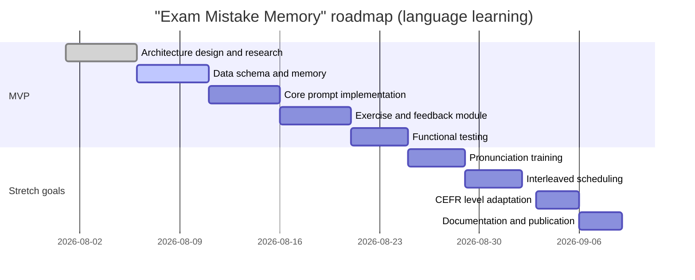

# References — Research Notes

Background research behind [`CLAUDE.md`](CLAUDE.md), written before the rewrite. It surveys evidence-based
language-learning methods (spaced repetition, retrieval practice, interleaving, corrective feedback,
input/output balance, TBLT, pronunciation training, CEFR alignment) and maps each one onto a prompt component
and a piece of learner data.

Not part of the prompt — kept as the reasoning trail for the design decisions in [`README.md`](README.md).

---

# Summary

The *Exam Mistake Memory* system is an AI memory protocol that **identifies a student's mistakes**, flags weak
concepts, and builds review sessions from past errors. In a language-learning context the prompt needs
refinement so that it focuses on *language* errors (grammar, vocabulary, pronunciation, and so on), balances
input against output, and matches difficulty to CEFR level. This report analyses evidence-based language
teaching techniques — spaced repetition, retrieval practice, interleaving and others — and maps each method onto
a prompt component and a piece of student data (error type, error annotation, timestamp, modality). It then
proposes refined prompt sections: system instruction, user message, assistant rules, feedback templates, error
taxonomy, and revision-session algorithm. Implementation notes cover the data schema, required inputs, privacy,
evaluation metrics (learning gains, retention, engagement), and a suggested tech stack. Finally it sets out a
prioritised roadmap (MVP and stretch goals) with a timeline. All recommendations draw on primary research and
established SLA (second language acquisition) sources.

## 1. The Original Project and Its Initial Prompt

**Exam Mistake Memory** (a Walrus Prompt Jam winner) focuses on personalised learning: an AI assistant remembers
a student's exam mistakes and generates revision sessions targeting recurring errors. In summary, the assistant:

- Records the student's answers and distinguishes correct from incorrect ones.
- Stores **structured memory** about the student's mistakes (topic/concept, error type, and so on).
- Highlights recurring error patterns (misconceptions) and weak topics.
- Plans follow-up **review sessions** that practise questions related to earlier mistakes, improving the
  student's study habits over time.

**Parts of the prompt that can be refined for a language programme:**

- **Input data.** The initial prompt centres on exam questions (pharmacy, for example). For language it needs to
  accommodate language content (text, audio, dialogue) and the four skill modules — reading, listening,
  speaking, writing.
- **Error classification.** The error categories need widening: not just facts, but *language* errors — grammar,
  vocabulary, spelling, pronunciation, register, contextual comprehension.
- **Feedback and hints.** As written, the prompt may only confirm right or wrong. Language work needs explicit
  feedback with a correction and an explanation ("this phrasing would be more natural…"), plus guidance on
  context of use.
- **Revision algorithm.** The logic that builds a revision session should follow SLA findings: schedule spaced
  repetition, use retrieval-practice quizzing, and interleave content across topics according to error type and
  timing.
- **Dialogue structure.** Add instructions so the assistant behaves like a language tutor: courteous, giving
  examples, asking the student to revise their answer, sustaining engagement. For instance, forbid changing
  topic before the exercise is answered, and always build on the student's stored error memory.

Strengthening these aspects turns a prompt built around traditional exam mistakes into an adaptive
language-learning agent.

## 2. Evidence-Based Language Learning Methods, Mapped to Prompt Components

A survey of the key methods and how each applies inside the prompt:

- **Spaced repetition.** Reviewing material at progressively longer intervals reliably improves retention.
  Inside the prompt, memory uses the *timestamp* of each error plus the student's mastery level to reschedule
  practice. If the student gets a vocabulary item wrong, the assistant records the timestamp and re-asks that
  word after an optimal delay, so hard material recurs often and mastered material recurs rarely. **Prompt
  component:** a revision-scheduling module keyed on *error type* and prior timing; a Leitner-box algorithm.
  **Student data:** error timestamps, correct/incorrect outcomes, repetition frequency per item. **Outcome:**
  stronger long-term recall of vocabulary and structures.

- **Retrieval practice.** Recall practice (quizzing, test-enhanced learning) strengthens memory far more than
  re-reading. The prompt can generate quiz items from past mistakes — re-asking a question the student once got
  wrong — which triggers active recall. Two conditions matter: aim for roughly 60–80% success for the effect to
  hold, and give **immediate corrective feedback** so misconceptions are not reinforced. **Prompt component:**
  generating review questions (flashcards or exercises) from the error memory, with feedback built into the same
  turn. **Student data:** the list of items previously answered wrong, plus notes on earlier corrections.
  **Outcome:** more durable retention; past errors repaired through repeated practice.

- **Interleaving.** Mixing practice across topics within a single session improves retention compared with
  blocked practice on one topic. In the prompt, a revision session can mix exercises drawn from different errors
  — vocabulary alongside grammar — or even across languages for a multilingual learner. **Prompt component:** an
  algorithm that alternates errors from different topics, and sequences a session across activity types
  (reading, listening, writing). **Student data:** topic category and error dimension; language, where more than
  one is being studied. **Outcome:** better discrimination between contexts, avoiding narrowly bound learning,
  and deeper understanding.

- **Input/output balance.** A comprehensive approach weighs *input* (comprehensible material) against *output*
  (language production). Krashen emphasises contextualised input (i+1) as the engine of acquisition, while Swain
  argues that pushing learners to **produce** language helps them notice the gaps in their own knowledge. The
  prompt can track the *modality* of each error (listening/speaking vs. reading/writing) and keep practice
  balanced — after a listening session, ask the student to restate or write down the key points. **Prompt
  component:** an input sequence (new text or audio) → processing exercise (comprehension) → output
  (answering/writing); plus shadowing or short essay tasks. **Student data:** error type by modality
  (mispronunciation in speaking mode, grammatical error in writing mode). **Outcome:** comprehension comes
  first, then internalisation through production, and more natural communication.

- **Corrective feedback.** Fast, clear feedback is essential so the student does not consolidate a wrong
  understanding. The system should flag the language error directly — spelling, grammar, meaning, pronunciation
  — and supply the repair or a correct example. **Prompt component:** specific corrective-comment templates
  ("this word should be…", "this is pronounced…") in the target language. **Student data:** error annotations
  ("preposition misuse", "wrong word choice") and the sentence context. **Outcome:** fewer repeated errors,
  active *noticing* ("I can see the gap"), better command of the correct structures.

- **Task-based learning.** TBLT emphasises using language in authentic tasks to build fluency. A refined prompt
  should include practical tasks — simulated dialogue, writing an email, answering interview questions — tied to
  the student's errors. If the student often makes mistakes in formal emails, the assistant should set an email
  task on that theme. **Prompt component:** a module that generates real tasks from error patterns (designing a
  conversation, a presentation, a role-play scenario). **Student data:** task type and context matched to the
  learner's ability profile. **Outcome:** better real communication skills and an understanding of language use
  in meaningful context.

- **Grammar in context.** Teaching grammar through communicative context supports functional understanding. The
  prompt should integrate grammar corrections into real dialogue rather than presenting abstract rules. When
  correcting a grammatical error, the assistant gives an example of use in a meaningful sentence. **Prompt
  component:** prompts that explore the form ("why is this form used here?") alongside conversational context,
  and repeated practice on grammar that carries meaning. **Student data:** the specific grammatical error and
  the example sentence context. **Outcome:** the student grasps the *function* of a structure in context rather
  than memorising a rule.

- **Pronunciation training.** Structured pronunciation instruction significantly improves speaking ability. The
  prompt can record phonetic errors — particular vowels or consonants — during speaking mode and trigger
  phonetic drills such as repetition and minimal pairs. **Prompt component:** an audio-analysis module where
  available, phonetic correction templates (presenting the correct phoneme), and repeated practice with acoustic
  feedback. **Student data:** the type of sound error (vowel, consonant, intonation) and audio recordings where
  available. **Outcome:** improved speaking fluency and listening comprehension; meta-analyses show a *large
  effect* for this kind of training, particularly when feedback is included.

- **Vocabulary acquisition strategies.** Vocabulary theory emphasises **multiple exposures** and strategy use
  (mnemonics, cognates, context) for word learning. The prompt should record failed vocabulary and feed it
  automatically into later sessions — virtual flashcards, cloze exercises, synonyms and antonyms,
  contextualisation. **Prompt component:** mapping vocabulary errors to repeated practice (spaced review,
  self-generated definitions, translation). **Student data:** the list of new or unmastered words and their
  exposure frequency. **Outcome:** more effective vocabulary acquisition through graduated repetition and
  mnemonic technique.

- **CEFR alignment.** The CEFR is the international standard for language proficiency (A1–C2). The prompt can
  adapt error content to the student's level: at B1 focus on simple complex sentences; at C1 add idiomatic
  usage. **Prompt component:** linking error diagnoses to CEFR *can-do descriptors*, and setting exercise
  difficulty and feedback to match the level. **Student data:** the learner's level profile, stated or estimated
  from their error pattern. **Outcome:** a structured learning path with globally measurable goals.

The table below summarises the mapping:

| Method | Prompt component / student data | Expected outcome |
|---|---|---|
| Spaced repetition | Reschedule review from the **timestamp** of prior errors and their difficulty Store mastery level per item (word or structure) | Improved long-term retention of vocabulary and structures |
| Retrieval practice | Generate quizzes/flashcards from the student's errors Immediate corrective feedback to consolidate memory | Strengthened memory, better long-term L2 retention |
| Interleaving | Algorithm mixing questions from different topics/skills within one session | Better contextual discrimination and comparison |
| Input/output balance | Listening/reading practice followed by a speaking/writing task on the same material | Balanced acquisition; i+1 comprehensible input followed by output; more natural production |
| Corrective feedback | Explicit language correction in context Supply the correct alternative immediately | Errors do not accumulate; misconceptions corrected faster |
| Task-based learning (TBLT) | Generate authentic tasks (dialogue, presentation, writing) from error patterns | Greater fluency and motivation through real context |
| Grammar in context | Teach grammar as a functional concept inside texts and dialogue | Functional grasp of grammar rather than rote rules |
| Pronunciation training | Targeted phonetic drills (minimal pairs, shadowing) for specific sound errors Audio feedback | Improved speaking fluency; large effect on pronunciation accuracy |
| Vocabulary strategies | Multiple meaningful exposures (flashcard, context, synonym) for failed words Embed words in later sessions | More effective vocabulary acquisition through graduated repetition |
| CEFR alignment | Link errors to level-specific *can-do* descriptors; adjust exercise difficulty | Structured, level-appropriate learning with measurable targets |

## 3. Sample Refined Prompt Sections

- **System instruction:**
  > "You are an adaptive language tutor assistant. Focus on the user's mistakes and progress. Each time the user
  > practices, analyze their answers, identify error types (grammar, vocabulary, pronunciation, etc.), and store
  > this data with timestamps. Use this mistake memory to design review sessions targeting recurring error
  > patterns and weak topics. Provide polite, constructive corrective feedback in the target language."

- **User message:** for example, "Help me practise the mistakes I've made in German grammar."

- **Assistant behaviour rules:**
  1. **Contextual and empathetic.** Answer in a supportive tone. Give concrete examples where useful.
  2. **Target language.** Always use the language the student is studying.
  3. **Focus on errors.** Prioritise the mistakes recorded in memory. Do not change topic before the previous
     error has been explained.
  4. **Constructive feedback.** Explain why the answer was wrong and show the correct form, using real context.
  5. **Apply the learning methods.** Proactively use spaced repetition, retrieval practice and the rest,
     according to the error diagnosis.
  6. **Privacy and transparency.** Make clear that the data is used only to support learning, in line with the
     privacy policy.

- **Feedback templates:**
  - *Grammar:* "Notice that you should use the **-ed** form. For example: *'She **walked** home,'* not *'She
    **walk** home.'* The **-ed** marks past tense."
  - *Vocabulary:* "The word **'huge'** fits better here than **'big'**. For example: *'They live in a **huge**
    house,'* not *'big house.'* 'Huge' adds emphasis."
  - *Pronunciation:* "Your **th** is coming out as **'d'**. Try the word **'think'**: /θɪŋk/. Place your tongue
    between your teeth."

- **Error classification taxonomy:**
  1. *Grammar:* inflection (tense, word endings), sentence structure (subject–predicate), particle use.
  2. *Vocabulary:* word choice (false friends, synonyms), spelling, idiomatic meaning.
  3. *Pronunciation:* specific phonemes (problem vowels and consonants), intonation, word stress.
  4. *Skill-specific:* comprehension errors (listening), text interpretation errors (reading), paragraph
     organisation (writing), speaking fluency.
  5. *CEFR level:* errors typical of each level — basic tenses at A2, passive constructions at B2.

- **Revision session algorithm:**
  1. **Retrieve recent errors.** Search memory for the student's mistakes — most recent and most frequent.
  2. **Select priority topics.** Weight recurring errors higher: vocabulary item X missed 3 times, grammar point
     Y missed twice, and so on.
  3. **Set the spacing.** Determine review timing from when the error was made — longer intervals after several
     correct answers, shorter if the student is still failing.
  4. **Design the exercises.** For each selected error topic, build a matching activity (multiple choice, gap
     fill, listening task) and interleave topics.
  5. **Insert feedback.** Correct immediately after each answer. On a wrong answer, update memory with the new
     error and offer an immediate retrieval retry.
  6. **Adjust difficulty.** Match complexity to the student's CEFR level — add complex sentence contexts at
     higher levels.
  7. **Loop.** Repeat until every priority topic has been practised in the session.

## 4. Implementation Notes

- **Data schema and inputs.** Store each student interaction as an object with: *user_id*,
  *question/activity*, *user_answer*, *correct_answer*, *activity_type* (read/write/listen/speak), *timestamp*,
  *error_type* (from the taxonomy above), and *error_count* (a counter). The database can use a structured
  format — JSON in MongoDB, or relational tables. *User input* covers answers, voice recordings where speaking
  is involved, and metadata (language level, learning goal).
- **Privacy.** Student error data is sensitive: it reveals personal ability. Apply encryption or secure storage
  (for example Walrus Memory's encrypted storage). Tell the user the data is used only to adapt their learning,
  in line with the privacy policy.
- **Evaluation metrics:**
  - *Learning gains:* measure with pre/post testing, or improvement in practice scores over time — compare quiz
    performance on the same topic before and after a review session.
  - *Retention:* the percentage of correct answers on re-testing days or weeks later, which checks the spaced
    repetition effect.
  - *Engagement:* sessions per day, interaction length, and response to feedback (the share of learners who
    return).
  - *Satisfaction:* a user questionnaire on the experience — was it clear, was it useful.
  - *CEFR progress:* if the student is recorded at a given CEFR level, evaluate whether they now meet the
    can-do descriptors for the next one.
- **Tech stack:**
  - *Backend:* Python (Flask/FastAPI) or Node.js for the API and application logic.
  - *AI/chatbot:* an LLM with memory integration (for example Claude with Walrus Memory or another external
    store) for answer analysis and exercise generation.
  - *Database:* memory storage — NoSQL such as MongoDB, or a vector database for fast retrieval of error
    patterns.
  - *Front end:* web or mobile app (React or Flutter) for text and audio interaction.
  - *Voice processing:* speech-to-text for spoken input, text-to-speech for pronunciation models.
  - *CI/CD:* GitHub for version control, GitHub Actions for automated testing.

## 5. Prioritised Roadmap and Timeline

- **MVP:**
  1. *Architecture design.* Define the memory data schema, the error taxonomy, and the interaction flow.
  2. *Core prompt.* Write a system instruction that can identify and store language errors and generate simple
     feedback.
  3. *Memory integration.* Build the memory-storage module (Walrus Memory) that records errors and queries
     recurring patterns.
  4. *Basic exercise generator.* Build the function that creates review questions from memory (simple spacing
     and retrieval).
  5. *Functional testing.* Test end to end whether the assistant collects errors and produces a relevant
     revision session.
- **Stretch goals:**
  1. *Pronunciation module.* Add audio analysis and phonetic drills with spoken feedback.
  2. *Interleaving and input/output adaptation.* Implement mixed-topic scheduling and input→output sequencing by
     level.
  3. *CEFR auto-detection.* Infer CEFR level from the student's error profile.
  4. *Advanced UI/UX.* A gamified interface to sustain engagement (rewards, progress bars).

A sample Gantt timeline for a roughly four-week hackathon:

## 6. Comparison Table — Method, Prompt Component, Outcome

| Learning method | Prompt component / strategy | Outcome |
|---|---|---|
| **Spaced repetition** | Reschedule practice from the error *timestamp*; Leitner-box memory | High long-term retention, flattened forgetting curve |
| **Retrieval practice** | Error-based quizzes and flashcards; immediate feedback during practice | Improved memory (testing effect), errors detected sooner |
| **Interleaving** | Mixed topic and vocabulary practice within one session | Greater flexibility of understanding and transfer of learning |
| **Input vs. output** | Balanced tasks: supporting material → processing practice → production (speaking/writing) | Balanced command of the language; more natural use |
| **Corrective feedback** | Explicit correction in context, with the correct example given immediately | Errors fully repaired, active noticing, fewer misconceptions |
| **Task-based learning** | Authentic tasks (conversation, presentation, writing) generated from errors | Greater fluency and motivation through real context |
| **Grammar in context** | Grammar taught as a functional concept through meaningful text | Deep, functional grasp of grammar |
| **Pronunciation** | Phonetic drills (minimal pairs, audio feedback) for specific sound errors | Improved sound accuracy and pronunciation scores |
| **Vocabulary strategies** | Repeat difficult words through varied techniques (mnemonic, context, flashcard) | Faster vocabulary acquisition through scheduled exposure |
| **CEFR alignment** | Match material to level (A1–C2) and can-do descriptors | Structured learning with clearer level targets |

**Note:** the table summarises how each method integrates into the prompt design and what it is expected to
achieve; the cited sources support the effectiveness of each.
